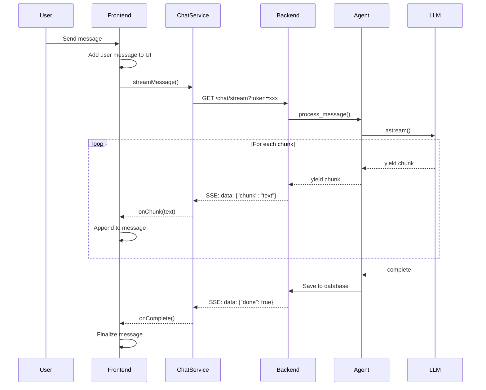

# Design Document: Chat Text Streaming

## Overview

This design implements real-time text streaming for the Shuren chat interface, replacing the current loading indicator with incremental text display. The solution leverages FastAPI's Server-Sent Events (SSE) support and LangChain's native streaming capabilities to deliver AI responses chunk-by-chunk as they're generated.

The architecture follows a producer-consumer pattern where the backend streams response chunks via SSE, and the frontend consumes them using the EventSource API, updating the UI incrementally.

## Architecture

### High-Level Flow



### Component Architecture

```mermaid
graph TB
    subgraph Frontend
        A[ChatPage/OnboardingChatPage]
        B[useChat Hook]
        C[ChatService]
        D[MessageList]
        E[EventSource API]
    end
    
    subgraph Backend
        F[/chat/stream Endpoint]
        G[/chat/onboarding-stream Endpoint]
        H[AgentOrchestrator]
        I[BaseAgent]
        J[LangChain LLM]
    end
    
    A --> B
    B --> C
    B --> D
    C --> E
    E --> F
    E --> G
    F --> H
    G --> H
    H --> I
    I --> J
```

## Components and Interfaces

### Backend Components

#### 1. Streaming Endpoints

**Official Documentation:**
- FastAPI StreamingResponse: https://fastapi.tiangolo.com/advanced/custom-response/#streamingresponse
- SSE Specification: https://html.spec.whatwg.org/multipage/server-sent-events.html

**File:** `backend/app/api/v1/endpoints/chat.py`

```python
from fastapi import APIRouter, Depends, Query
from fastapi.responses import StreamingResponse
from app.core.security import get_current_user
from app.services.agent_orchestrator import AgentOrchestrator

router = APIRouter()

@router.get("/stream")
async def stream_chat(
    message: str = Query(...),
    token: str = Query(...),  # EventSource limitation workaround
    db: AsyncSession = Depends(get_db),
    user: User = Depends(get_current_user_from_token)
):
    """
    Stream chat responses using Server-Sent Events.
    
    Official FastAPI pattern for SSE:
    https://fastapi.tiangolo.com/advanced/custom-response/#streamingresponse
    """
    async def event_generator():
        try:
            orchestrator = AgentOrchestrator(db, user)
            
            async for chunk in orchestrator.stream_response(message):
                # SSE format: data: {json}\n\n
                yield f"data: {json.dumps({'chunk': chunk})}\n\n"
            
            # Save complete message to database
            await orchestrator.save_conversation(message, full_response)
            
            # Send completion event
            yield f"data: {json.dumps({'done': True, 'agent_type': agent_type})}\n\n"
            
        except Exception as e:
            yield f"data: {json.dumps({'error': str(e)})}\n\n"
    
    return StreamingResponse(
        event_generator(),
        media_type="text/event-stream",
        headers={
            "Cache-Control": "no-cache",
            "Connection": "keep-alive",
            "X-Accel-Buffering": "no"  # Disable nginx buffering
        }
    )

@router.get("/onboarding-stream")
async def stream_onboarding_chat(
    message: str = Query(...),
    token: str = Query(...),
    db: AsyncSession = Depends(get_db),
    user: User = Depends(get_current_user_from_token)
):
    """Stream onboarding chat responses with state management."""
    async def event_generator():
        try:
            orchestrator = AgentOrchestrator(db, user)
            
            async for chunk in orchestrator.stream_onboarding_response(message):
                yield f"data: {json.dumps({'chunk': chunk})}\n\n"
            
            # Update onboarding state if needed
            await orchestrator.update_onboarding_progress()
            
            yield f"data: {json.dumps({'done': True})}\n\n"
            
        except Exception as e:
            yield f"data: {json.dumps({'error': str(e)})}\n\n"
    
    return StreamingResponse(
        event_generator(),
        media_type="text/event-stream",
        headers={
            "Cache-Control": "no-cache",
            "Connection": "keep-alive",
            "X-Accel-Buffering": "no"
        }
    )
```

#### 2. Agent Streaming

**Official Documentation:**
- LangChain Streaming: https://python.langchain.com/docs/how_to/streaming/
- LangChain astream(): https://api.python.langchain.com/en/latest/runnables/langchain_core.runnables.base.Runnable.html#langchain_core.runnables.base.Runnable.astream

**File:** `backend/app/agents/base_agent.py`

```python
from langchain_anthropic import ChatAnthropic
from typing import AsyncIterator

class BaseAgent:
    def __init__(self, llm: ChatAnthropic):
        self.llm = llm
    
    async def stream_response(self, prompt: str) -> AsyncIterator[str]:
        """
        Stream LLM response using LangChain's native astream().
        
        Official LangChain streaming pattern:
        https://python.langchain.com/docs/how_to/streaming/
        """
        full_response = ""
        
        async for chunk in self.llm.astream(prompt):
            if chunk.content:
                full_response += chunk.content
                yield chunk.content
        
        # Store full response for database save
        self._last_response = full_response
```

**File:** `backend/app/services/agent_orchestrator.py`

```python
class AgentOrchestrator:
    async def stream_response(self, message: str) -> AsyncIterator[str]:
        """Route message to appropriate agent and stream response."""
        agent = self._select_agent(message)
        
        async for chunk in agent.stream_response(message):
            yield chunk
    
    async def stream_onboarding_response(self, message: str) -> AsyncIterator[str]:
        """Stream onboarding-specific responses."""
        # Load onboarding context
        onboarding_state = await self._load_onboarding_state()
        
        agent = self.conversational_agent
        prompt = self._build_onboarding_prompt(message, onboarding_state)
        
        async for chunk in agent.stream_response(prompt):
            yield chunk
```

### Frontend Components

#### 3. Chat Service

**Official Documentation:**
- EventSource API: https://developer.mozilla.org/en-US/docs/Web/API/EventSource
- SSE Client Pattern: https://developer.mozilla.org/en-US/docs/Web/API/Server-sent_events/Using_server-sent_events

**File:** `frontend/src/services/chatService.ts`

```typescript
interface StreamCallbacks {
  onChunk: (chunk: string) => void;
  onComplete: (agentType?: string) => void;
  onError: (error: string) => void;
}

class ChatService {
  private activeStream: EventSource | null = null;

  /**
   * Stream chat message using EventSource API.
   * 
   * Official MDN documentation:
   * https://developer.mozilla.org/en-US/docs/Web/API/EventSource
   */
  streamMessage(
    message: string,
    callbacks: StreamCallbacks,
    isOnboarding: boolean = false
  ): () => void {
    const token = this.getAuthToken();
    const endpoint = isOnboarding ? '/chat/onboarding-stream' : '/chat/stream';
    
    // EventSource doesn't support custom headers, use query param
    const url = `${API_BASE_URL}${endpoint}?message=${encodeURIComponent(message)}&token=${token}`;
    
    this.activeStream = new EventSource(url);
    
    this.activeStream.onmessage = (event) => {
      try {
        const data = JSON.parse(event.data);
        
        if (data.error) {
          callbacks.onError(data.error);
          this.activeStream?.close();
        } else if (data.done) {
          callbacks.onComplete(data.agent_type);
          this.activeStream?.close();
        } else if (data.chunk) {
          callbacks.onChunk(data.chunk);
        }
      } catch (error) {
        callbacks.onError('Failed to parse response');
        this.activeStream?.close();
      }
    };
    
    this.activeStream.onerror = (error) => {
      callbacks.onError('Connection error');
      this.activeStream?.close();
    };
    
    // Return cancellation function
    return () => {
      this.activeStream?.close();
      this.activeStream = null;
    };
  }

  cancelStream(): void {
    if (this.activeStream) {
      this.activeStream.close();
      this.activeStream = null;
    }
  }
}

export const chatService = new ChatService();
```

#### 4. Chat Hook

**Official Documentation:**
- React useState: https://react.dev/reference/react/useState
- React useEffect: https://react.dev/reference/react/useEffect
- React useCallback: https://react.dev/reference/react/useCallback

**File:** `frontend/src/hooks/useChat.ts`

```typescript
import { useState, useCallback, useEffect, useRef } from 'react';
import { chatService } from '../services/chatService';

interface Message {
  id: string;
  role: 'user' | 'assistant';
  content: string;
  isStreaming?: boolean;
  error?: string;
}

export function useChat(isOnboarding: boolean = false) {
  const [messages, setMessages] = useState<Message[]>([]);
  const [isStreaming, setIsStreaming] = useState(false);
  const cancelStreamRef = useRef<(() => void) | null>(null);

  /**
   * Send message and handle streaming response.
   * Uses React's official state management patterns.
   */
  const sendMessage = useCallback(async (content: string) => {
    if (isStreaming) return;

    // Add user message immediately
    const userMessage: Message = {
      id: crypto.randomUUID(),
      role: 'user',
      content,
    };
    
    setMessages(prev => [...prev, userMessage]);
    setIsStreaming(true);

    // Create placeholder for assistant message
    const assistantMessageId = crypto.randomUUID();
    const assistantMessage: Message = {
      id: assistantMessageId,
      role: 'assistant',
      content: '',
      isStreaming: true,
    };
    
    setMessages(prev => [...prev, assistantMessage]);

    // Start streaming
    cancelStreamRef.current = chatService.streamMessage(
      content,
      {
        onChunk: (chunk: string) => {
          setMessages(prev =>
            prev.map(msg =>
              msg.id === assistantMessageId
                ? { ...msg, content: msg.content + chunk }
                : msg
            )
          );
        },
        onComplete: () => {
          setMessages(prev =>
            prev.map(msg =>
              msg.id === assistantMessageId
                ? { ...msg, isStreaming: false }
                : msg
            )
          );
          setIsStreaming(false);
          cancelStreamRef.current = null;
        },
        onError: (error: string) => {
          setMessages(prev =>
            prev.map(msg =>
              msg.id === assistantMessageId
                ? { ...msg, isStreaming: false, error }
                : msg
            )
          );
          setIsStreaming(false);
          cancelStreamRef.current = null;
        },
      },
      isOnboarding
    );
  }, [isStreaming, isOnboarding]);

  // Cleanup on unmount
  useEffect(() => {
    return () => {
      if (cancelStreamRef.current) {
        cancelStreamRef.current();
      }
    };
  }, []);

  const retryLastMessage = useCallback(() => {
    const lastUserMessage = [...messages]
      .reverse()
      .find(msg => msg.role === 'user');
    
    if (lastUserMessage) {
      // Remove failed assistant message
      setMessages(prev => prev.slice(0, -1));
      sendMessage(lastUserMessage.content);
    }
  }, [messages, sendMessage]);

  return {
    messages,
    isStreaming,
    sendMessage,
    retryLastMessage,
  };
}
```

#### 5. Message List Component

**Official Documentation:**
- React useRef: https://react.dev/reference/react/useRef
- React useEffect: https://react.dev/reference/react/useEffect
- ARIA Live Regions: https://developer.mozilla.org/en-US/docs/Web/Accessibility/ARIA/ARIA_Live_Regions

**File:** `frontend/src/components/MessageList.tsx`

```typescript
import React, { useEffect, useRef } from 'react';

interface MessageListProps {
  messages: Message[];
}

export function MessageList({ messages }: MessageListProps) {
  const messagesEndRef = useRef<HTMLDivElement>(null);
  const scrollTimeoutRef = useRef<NodeJS.Timeout>();

  /**
   * Auto-scroll with debouncing for performance.
   * Uses official React ref pattern for DOM manipulation.
   */
  useEffect(() => {
    // Debounce scroll updates during rapid streaming
    if (scrollTimeoutRef.current) {
      clearTimeout(scrollTimeoutRef.current);
    }

    scrollTimeoutRef.current = setTimeout(() => {
      messagesEndRef.current?.scrollIntoView({ behavior: 'smooth' });
    }, 100);

    return () => {
      if (scrollTimeoutRef.current) {
        clearTimeout(scrollTimeoutRef.current);
      }
    };
  }, [messages]);

  return (
    <div className="message-list">
      {/* ARIA live region for accessibility */}
      <div aria-live="polite" aria-atomic="false" className="sr-only">
        {messages[messages.length - 1]?.isStreaming && 
          'Assistant is responding'}
      </div>

      {messages.map((message) => (
        <div
          key={message.id}
          className={`message message-${message.role}`}
        >
          <div className="message-content">
            {message.content}
            {message.isStreaming && (
              <span 
                className="typing-cursor"
                aria-label="typing"
              >
                ▊
              </span>
            )}
          </div>
          
          {message.error && (
            <div className="message-error" role="alert">
              {message.error}
            </div>
          )}
        </div>
      ))}
      
      <div ref={messagesEndRef} />
    </div>
  );
}
```

#### 6. Chat Pages

**File:** `frontend/src/pages/ChatPage.tsx`

```typescript
import React from 'react';
import { useChat } from '../hooks/useChat';
import { MessageList } from '../components/MessageList';
import { ChatInput } from '../components/ChatInput';

export function ChatPage() {
  const { messages, isStreaming, sendMessage } = useChat(false);

  return (
    <div className="chat-page">
      <MessageList messages={messages} />
      <ChatInput 
        onSend={sendMessage} 
        disabled={isStreaming}
        placeholder={isStreaming ? 'Waiting for response...' : 'Type a message...'}
      />
    </div>
  );
}
```

**File:** `frontend/src/pages/OnboardingChatPage.tsx`

```typescript
import React from 'react';
import { useChat } from '../hooks/useChat';
import { MessageList } from '../components/MessageList';
import { ChatInput } from '../components/ChatInput';

export function OnboardingChatPage() {
  const { messages, isStreaming, sendMessage } = useChat(true);

  return (
    <div className="onboarding-chat-page">
      <div className="onboarding-header">
        <h2>Let's get to know you</h2>
      </div>
      <MessageList messages={messages} />
      <ChatInput 
        onSend={sendMessage} 
        disabled={isStreaming}
        placeholder={isStreaming ? 'Waiting for response...' : 'Tell me about yourself...'}
      />
    </div>
  );
}
```

## Data Models

### Message State

```typescript
interface Message {
  id: string;                    // Unique identifier (UUID)
  role: 'user' | 'assistant';    // Message sender
  content: string;               // Message text (accumulates during streaming)
  isStreaming?: boolean;         // True while receiving chunks
  error?: string;                // Error message if streaming failed
  timestamp?: Date;              // When message was created
  agentType?: string;            // Which agent responded (for analytics)
}
```

### SSE Event Formats

```typescript
// Chunk event
{
  "chunk": "text content"
}

// Completion event
{
  "done": true,
  "agent_type": "general" | "workout" | "diet" | etc.
}

// Error event
{
  "error": "error message"
}
```

## Correctness Properties

*A property is a characteristic or behavior that should hold true across all valid executions of a system—essentially, a formal statement about what the system should do. Properties serve as the bridge between human-readable specifications and machine-verifiable correctness guarantees.*


### Property Reflection

After analyzing all acceptance criteria, I've identified the following consolidations to eliminate redundancy:

**Consolidations:**
1. Properties 1.1 and 1.2 (SSE streaming for both endpoints) can be combined into one property about SSE format compliance
2. Properties 1.4 and 1.5 (chunk format and completion format) are both about SSE event format and can be combined
3. Properties 2.4, 2.5, and 2.6 (callback invocations) can be combined into one property about correct callback routing
4. Properties 3.3 and 4.1 (chunk appending and rendering) are testing the same accumulation behavior at different layers
5. Properties 4.3 and 4.4 (showing/hiding typing indicator) can be combined into one property about indicator state
6. Properties 7.1 and 7.2 (navigation and unmount cleanup) are both about connection cleanup and can be combined
7. Properties 8.1, 8.2, and 8.3 (ARIA announcements and labels) can be combined into one comprehensive accessibility property

**Unique Properties Retained:**
- SSE format compliance (combines 1.1, 1.2, 1.4, 1.5)
- Database persistence after streaming (1.6)
- Error event format (1.8)
- EventSource creation with auth (2.1, 2.2)
- JSON parsing (2.3)
- Callback routing (combines 2.4, 2.5, 2.6)
- Connection cleanup (2.7)
- User message immediate display (3.1)
- Placeholder creation (3.2)
- Content accumulation (combines 3.3, 4.1)
- Message finalization (3.4)
- Error state marking (3.5)
- Concurrent send prevention (3.6)
- Conversation history (3.7)
- Typing indicator state (combines 4.3, 4.4)
- Auto-scroll behavior (4.5)
- Visual distinction (4.6)
- Onboarding state consistency (5.3)
- Onboarding progress update (5.4)
- UI consistency between chat types (5.5)
- Error message display (6.1, 6.4 combined)
- Retry button presence (6.2)
- Partial response preservation (6.5)
- Error logging (6.6)
- Component cleanup (combines 7.1, 7.2)
- Sequential message processing (7.3)
- Single connection limit (7.5)
- Accessibility compliance (combines 8.1, 8.2, 8.3)
- Keyboard navigation (8.4)
- Focus management (8.5)
- Render batching (9.1)
- Scroll debouncing (9.3)

### Correctness Properties

Property 1: SSE Format Compliance
*For any* streaming request (regular or onboarding), all events sent by the backend should follow the SSE specification format: chunk events as `data: {"chunk": "text"}\n\n`, completion events as `data: {"done": true, "agent_type": "name"}\n\n`, and error events as `data: {"error": "message"}\n\n`
**Validates: Requirements 1.1, 1.2, 1.4, 1.5, 1.8**

Property 2: Streaming Persistence Round-Trip
*For any* message that is streamed, after streaming completes, querying the database should return the complete accumulated response
**Validates: Requirements 1.6**

Property 3: EventSource Connection Creation
*For any* call to `streamMessage()`, an EventSource connection should be created with the authentication token included as a query parameter in the URL
**Validates: Requirements 2.1, 2.2**

Property 4: JSON Event Parsing
*For any* SSE message event received, the Chat_Service should successfully parse the JSON payload without throwing errors
**Validates: Requirements 2.3**

Property 5: Callback Routing Correctness
*For any* SSE event received (chunk, completion, or error), the Chat_Service should invoke the corresponding callback (onChunk, onComplete, or onError) with the correct data extracted from the event
**Validates: Requirements 2.4, 2.5, 2.6**

Property 6: Connection Cleanup
*For any* EventSource connection that is closed (via cancellation, completion, or error), the Chat_Service should clean up the EventSource instance and set it to null
**Validates: Requirements 2.7**

Property 7: Immediate User Message Display
*For any* user message sent, the message should appear in the conversation state immediately before the streaming request is initiated
**Validates: Requirements 3.1**

Property 8: Placeholder Message Creation
*For any* streaming session started, a placeholder assistant message with empty content and `isStreaming: true` should be added to the conversation state
**Validates: Requirements 3.2**

Property 9: Content Accumulation Invariant
*For any* sequence of chunks received during streaming, the final message content should equal the concatenation of all chunks in the order they were received
**Validates: Requirements 3.3, 4.1**

Property 10: Message Finalization
*For any* streaming session that completes successfully, the assistant message should have `isStreaming: false` after the completion event is processed
**Validates: Requirements 3.4**

Property 11: Error State Marking
*For any* streaming session that fails, the assistant message should have an `error` property containing the error message
**Validates: Requirements 3.5**

Property 12: Concurrent Send Prevention
*For any* chat session, if a streaming message exists (isStreaming is true), attempting to send a new message should be blocked until streaming completes
**Validates: Requirements 3.6**

Property 13: Conversation History Preservation
*For any* sequence of messages sent and received, the conversation state should contain all messages in chronological order with no messages lost or duplicated
**Validates: Requirements 3.7**

Property 14: Typing Indicator State Consistency
*For any* message displayed, the typing indicator should be visible if and only if `isStreaming` is true
**Validates: Requirements 4.3, 4.4**

Property 15: Auto-Scroll Behavior
*For any* new content added to a streaming message, the message list should scroll to keep the latest content visible within 100ms (debounced)
**Validates: Requirements 4.5**

Property 16: Visual State Distinction
*For any* message rendered, streaming messages and finalized messages should have different visual attributes (CSS classes or data attributes)
**Validates: Requirements 4.6**

Property 17: Onboarding State Consistency
*For any* onboarding chat streaming session, the onboarding state should remain consistent and not be corrupted by concurrent updates
**Validates: Requirements 5.3**

Property 18: Onboarding Progress Update
*For any* onboarding streaming session that completes, if the response indicates progress should be updated, the onboarding state should reflect the new progress
**Validates: Requirements 5.4**

Property 19: Chat UI Consistency
*For any* message displayed in onboarding chat versus regular chat, the rendering should be identical (same components, same styling)
**Validates: Requirements 5.5**

Property 20: Error Message Display
*For any* streaming error (network error or server error event), an error message should be displayed to the user in the UI
**Validates: Requirements 6.1, 6.4**

Property 21: Retry Button Availability
*For any* failed streaming message, a retry button should be available in the UI
**Validates: Requirements 6.2**

Property 22: Partial Response Preservation
*For any* streaming session that is interrupted before completion, all chunks received up to the interruption point should be preserved in the message content
**Validates: Requirements 6.5**

Property 23: Error Logging
*For any* error that occurs during streaming (connection error, parsing error, or server error), the error details should be logged to the console or logging service
**Validates: Requirements 6.6**

Property 24: Component Cleanup on Unmount
*For any* chat component that unmounts or navigates away, any active EventSource connection should be closed and cleaned up
**Validates: Requirements 7.1, 7.2**

Property 25: Sequential Message Processing
*For any* sequence of messages sent rapidly, they should be processed one at a time in the order they were sent, with each message waiting for the previous stream to complete
**Validates: Requirements 7.3**

Property 26: Single Connection Limit
*For any* chat session, there should be at most one active EventSource connection at any given time
**Validates: Requirements 7.5**

Property 27: Accessibility Compliance
*For any* streaming message update, ARIA live regions should announce changes, completion events should be announced, and typing indicators should have appropriate ARIA labels
**Validates: Requirements 8.1, 8.2, 8.3**

Property 28: Keyboard Navigation Preservation
*For any* streaming update, keyboard navigation (tab, arrow keys, enter) should continue to work without interruption
**Validates: Requirements 8.4**

Property 29: Focus Management Stability
*For any* streaming update, the currently focused element should remain focused unless the user explicitly changes focus
**Validates: Requirements 8.5**

Property 30: Render Batching
*For any* rapid sequence of chunks (arriving within 50ms of each other), the UI should batch updates to avoid excessive re-renders
**Validates: Requirements 9.1**

Property 31: Scroll Debouncing
*For any* sequence of chunks during streaming, scroll updates should be debounced to occur at most once every 100ms
**Validates: Requirements 9.3**

## Error Handling

### Backend Error Scenarios

1. **Authentication Failure**
   - Return HTTP 401 before starting stream
   - Include error message in response body
   - Log authentication attempt

2. **LLM Service Unavailable**
   - Send error event: `data: {"error": "AI service temporarily unavailable"}\n\n`
   - Close stream gracefully
   - Log error with context

3. **Database Save Failure**
   - Complete streaming to user (don't interrupt UX)
   - Log error with full message content
   - Retry save in background (Celery task)

4. **Stream Timeout**
   - If no chunks generated for 30 seconds, send error event
   - Close connection
   - Log timeout with user context

### Frontend Error Scenarios

1. **Network Connection Lost**
   - EventSource `onerror` triggered
   - Display: "Connection lost. Please check your internet."
   - Provide retry button
   - Preserve partial response

2. **Invalid JSON in SSE Event**
   - Catch parse error in `onmessage`
   - Display: "Received invalid response from server"
   - Log raw event data
   - Close connection

3. **Authentication Token Expired**
   - Backend returns 401
   - Display: "Session expired. Please log in again."
   - Redirect to login after user acknowledgment
   - Clear local auth state

4. **Component Unmounted During Streaming**
   - useEffect cleanup function called
   - Close EventSource connection
   - Cancel any pending callbacks
   - No error displayed (user navigated intentionally)

### Error Recovery Patterns

```typescript
// Retry with exponential backoff
async function retryWithBackoff(
  fn: () => Promise<void>,
  maxRetries: number = 3
): Promise<void> {
  for (let i = 0; i < maxRetries; i++) {
    try {
      await fn();
      return;
    } catch (error) {
      if (i === maxRetries - 1) throw error;
      await new Promise(resolve => 
        setTimeout(resolve, Math.pow(2, i) * 1000)
      );
    }
  }
}
```

## Testing Strategy

### Dual Testing Approach

This feature requires both unit tests and property-based tests for comprehensive coverage:

- **Unit tests**: Verify specific examples, edge cases, and error conditions
- **Property tests**: Verify universal properties across all inputs using Hypothesis (Python) and fast-check (TypeScript)

### Backend Testing

**Framework**: pytest with pytest-asyncio and Hypothesis

**Unit Tests** (`test_chat_streaming_endpoints.py`):
- Test `/chat/stream` returns 401 with invalid token
- Test `/chat/onboarding-stream` returns 401 with invalid token
- Test streaming timeout after 60 seconds of inactivity
- Test database save failure doesn't interrupt stream
- Test LLM service unavailable sends error event

**Property Tests** (`test_chat_streaming_properties.py`):
- Property 1: SSE format compliance (100+ iterations with random messages)
- Property 2: Streaming persistence round-trip (100+ iterations)
- Tag format: `# Feature: chat-text-streaming, Property 1: SSE Format Compliance`

**Integration Tests** (`test_integration_streaming.py`):
- Test complete streaming flow from request to database save
- Test onboarding streaming updates onboarding state
- Test concurrent requests are handled correctly

### Frontend Testing

**Framework**: Jest with React Testing Library and fast-check

**Unit Tests** (`chatService.test.ts`):
- Test EventSource creation with correct URL and token
- Test cancellation closes EventSource
- Test error event triggers error callback
- Test connection cleanup on close

**Unit Tests** (`useChat.test.ts`):
- Test user message added immediately
- Test placeholder created on stream start
- Test retry removes failed message and resends
- Test unmount cancels active stream

**Unit Tests** (`MessageList.test.tsx`):
- Test typing indicator shown when isStreaming is true
- Test typing indicator hidden when isStreaming is false
- Test auto-scroll triggered on content update
- Test ARIA live region announces streaming

**Property Tests** (`chatStreaming.properties.test.ts`):
- Property 9: Content accumulation invariant (100+ iterations with random chunk sequences)
- Property 13: Conversation history preservation (100+ iterations)
- Property 25: Sequential message processing (100+ iterations)
- Tag format: `// Feature: chat-text-streaming, Property 9: Content Accumulation Invariant`

**Example Property Test**:
```typescript
import fc from 'fast-check';

describe('Property: Content Accumulation Invariant', () => {
  // Feature: chat-text-streaming, Property 9: Content Accumulation Invariant
  it('should accumulate chunks in order', () => {
    fc.assert(
      fc.property(
        fc.array(fc.string(), { minLength: 1, maxLength: 50 }),
        (chunks) => {
          const { result } = renderHook(() => useChat());
          
          act(() => {
            result.current.sendMessage('test');
          });
          
          // Simulate chunk arrival
          chunks.forEach(chunk => {
            act(() => {
              // Trigger onChunk callback
              mockOnChunk(chunk);
            });
          });
          
          const assistantMessage = result.current.messages.find(
            m => m.role === 'assistant'
          );
          
          expect(assistantMessage?.content).toBe(chunks.join(''));
        }
      ),
      { numRuns: 100 }
    );
  });
});
```

### E2E Testing

**Framework**: Playwright

**Test Scenarios**:
- User sends message and sees streaming response
- User navigates away during streaming (connection closed)
- Network disconnects during streaming (error shown, retry works)
- Multiple messages sent in sequence (processed one at a time)
- Onboarding chat streaming works identically to regular chat

### Performance Testing

**Metrics to Monitor**:
- Time to first chunk: < 500ms
- Chunk processing latency: < 10ms per chunk
- UI frame rate during streaming: > 55fps
- Memory usage during long streaming sessions: < 50MB increase
- EventSource connection overhead: < 5KB

**Load Testing**:
- 100 concurrent streaming sessions
- 1000 chunks per session
- Verify no memory leaks
- Verify all connections cleaned up

### Testing Configuration

All property-based tests must run minimum 100 iterations due to randomization. Each test must reference its design document property using the tag format specified above.

## Implementation Notes

### Backend Considerations

1. **Nginx Configuration**: Disable buffering for SSE endpoints
   ```nginx
   location /api/v1/chat/stream {
       proxy_buffering off;
       proxy_cache off;
       proxy_set_header Connection '';
       proxy_http_version 1.1;
       chunked_transfer_encoding off;
   }
   ```

2. **LangChain Streaming**: Use `astream()` not `stream()` for async compatibility
   ```python
   async for chunk in llm.astream(prompt):
       yield chunk.content
   ```

3. **Database Connection**: Use separate session for save to avoid blocking stream
   ```python
   async with AsyncSession() as save_session:
       await save_conversation(save_session, message, response)
   ```

### Frontend Considerations

1. **EventSource Polyfill**: Consider polyfill for older browsers
   ```typescript
   import { EventSourcePolyfill } from 'event-source-polyfill';
   ```

2. **React 18 Automatic Batching**: Leverage automatic batching for performance
   - Multiple setState calls in same event handler are batched
   - No need for manual batching in most cases

3. **Memory Management**: Clear message history for long conversations
   ```typescript
   // Keep only last 50 messages
   if (messages.length > 50) {
     setMessages(prev => prev.slice(-50));
   }
   ```

4. **Scroll Performance**: Use `requestAnimationFrame` for smooth scrolling
   ```typescript
   requestAnimationFrame(() => {
     messagesEndRef.current?.scrollIntoView({ behavior: 'smooth' });
   });
   ```

### Security Considerations

1. **Token Exposure**: Query parameter tokens are logged in server access logs
   - Use short-lived tokens (5 minute expiry)
   - Rotate tokens after use
   - Consider WebSocket upgrade for production

2. **Rate Limiting**: Prevent abuse of streaming endpoints
   - Limit to 10 concurrent streams per user
   - Limit to 100 messages per hour per user
   - Implement exponential backoff on errors

3. **Content Validation**: Sanitize streamed content before display
   ```typescript
   import DOMPurify from 'dompurify';
   
   const sanitizedContent = DOMPurify.sanitize(chunk);
   ```

### Monitoring and Observability

1. **Metrics to Track**:
   - Streaming session duration (avg, p95, p99)
   - Chunks per session (avg, max)
   - Error rate by error type
   - Connection cleanup success rate
   - Database save success rate

2. **Logging**:
   - Log stream start with user_id and message_id
   - Log stream completion with duration and chunk count
   - Log all errors with full context
   - Log cleanup events

3. **Alerts**:
   - Alert if error rate > 5%
   - Alert if avg stream duration > 30s
   - Alert if connection cleanup rate < 95%
   - Alert if database save failure rate > 1%

## Migration Strategy

### Phase 1: Backend Preparation (Week 1)
1. Add `/chat/onboarding-stream` endpoint
2. Ensure existing `/chat/stream` is production-ready
3. Add monitoring and logging
4. Deploy to staging

### Phase 2: Frontend Implementation (Week 2)
1. Implement `useChat` hook with streaming
2. Update `MessageList` component
3. Add error handling and retry logic
4. Test in development environment

### Phase 3: Gradual Rollout (Week 3)
1. Deploy frontend with feature flag disabled
2. Enable for internal users (10%)
3. Monitor metrics and gather feedback
4. Enable for beta users (25%)
5. Full rollout (100%)

### Phase 4: Cleanup (Week 4)
1. Remove feature flag
2. Remove old loading indicator code
3. Update documentation
4. Archive non-streaming code path

### Rollback Plan

If critical issues arise:
1. Disable feature flag (instant rollback)
2. Frontend falls back to non-streaming endpoint
3. Users see loading indicator instead of streaming
4. No data loss or functionality impact

## Future Enhancements

1. **WebSocket Upgrade**: Replace SSE with WebSocket for bidirectional communication
2. **Markdown Streaming**: Parse and render markdown as it streams
3. **Code Block Streaming**: Syntax highlight code blocks in real-time
4. **Voice Streaming**: Integrate with LiveKit for voice response streaming
5. **Multi-Agent Streaming**: Show which agent is responding in real-time
6. **Streaming Cancellation**: Allow users to stop generation mid-stream
7. **Streaming Analytics**: Track user engagement with streaming vs non-streaming
