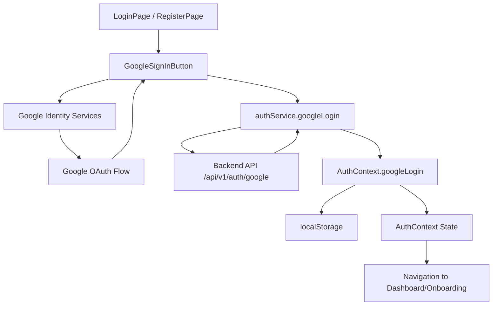
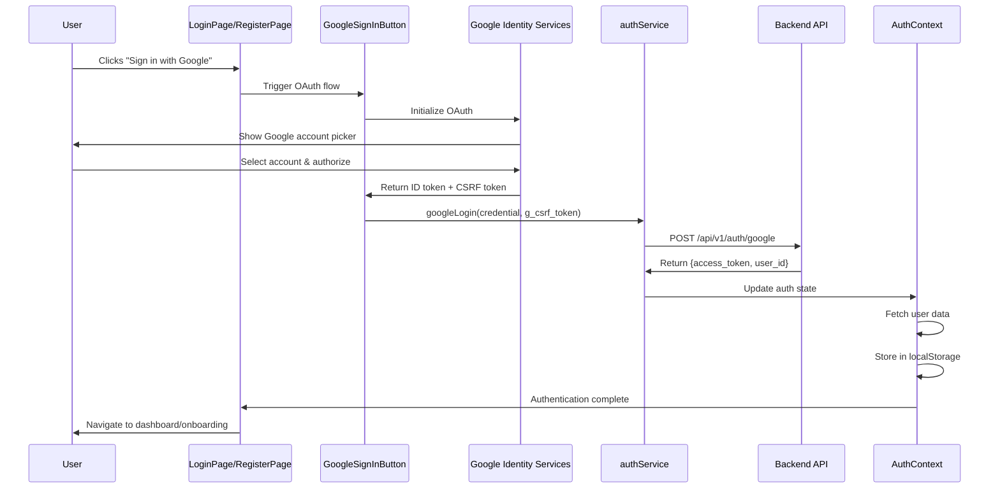

# Design Document: Frontend Google OAuth Integration

## Overview

This design document specifies the implementation of Google OAuth 2.0 authentication in the Shuren frontend React application. The implementation integrates with the existing backend Google OAuth endpoint (POST /api/v1/auth/google) and provides a seamless "Sign in with Google" experience on both login and registration pages.

The design follows React best practices with TypeScript, integrates with the existing authentication context, and maintains backward compatibility with email/password authentication. The implementation uses Google Identity Services (GSI) library for OAuth flows and includes proper CSRF token handling, loading states, error handling, and user navigation.

Key design principles:
- **Reusability**: Single GoogleSignInButton component used across pages
- **Type Safety**: Full TypeScript coverage with proper interfaces
- **Consistency**: Matches existing auth flow patterns and UI styling
- **Security**: Proper CSRF token extraction and submission
- **User Experience**: Clear loading states, error messages, and navigation

## Architecture

### High-Level Component Structure



### Authentication Flow



### File Structure

```
frontend/src/
├── components/
│   └── auth/
│       └── GoogleSignInButton.tsx       # New reusable component
├── contexts/
│   └── AuthContext.tsx                  # Updated with googleLogin
├── services/
│   └── authService.ts                   # Updated with googleLogin
├── types/
│   └── auth.types.ts                    # Updated with Google OAuth types
├── pages/
│   ├── LoginPage.tsx                    # Updated with Google button
│   └── RegisterPage.tsx                 # Updated with Google button
└── utils/
    └── cookies.ts                       # New utility for cookie extraction
```

## Components and Interfaces

### 1. GoogleSignInButton Component

**Location**: `frontend/src/components/auth/GoogleSignInButton.tsx`

**Purpose**: Reusable component that renders the official Google sign-in button and handles the OAuth flow.

**Props Interface**:
```typescript
interface GoogleSignInButtonProps {
  onSuccess: (response: GoogleAuthResponse) => void;
  onError: (error: string) => void;
  disabled?: boolean;
}
```

**Component Structure**:
```typescript
export const GoogleSignInButton: React.FC<GoogleSignInButtonProps> = ({
  onSuccess,
  onError,
  disabled = false
}) => {
  const [loading, setLoading] = useState(false);
  const buttonRef = useRef<HTMLDivElement>(null);

  // Load Google Identity Services script
  useEffect(() => {
    const loadGoogleScript = () => {
      // Check if script already loaded
      if (window.google) {
        initializeGoogleSignIn();
        return;
      }

      // Create script element
      const script = document.createElement('script');
      script.src = 'https://accounts.google.com/gsi/client';
      script.async = true;
      script.defer = true;
      script.onload = initializeGoogleSignIn;
      script.onerror = () => {
        console.error('Failed to load Google Identity Services');
      };
      document.body.appendChild(script);
    };

    loadGoogleScript();
  }, []);

  // Initialize Google Sign-In
  const initializeGoogleSignIn = () => {
    const clientId = import.meta.env.VITE_GOOGLE_CLIENT_ID;
    
    if (!clientId) {
      console.warn('VITE_GOOGLE_CLIENT_ID not configured');
      return;
    }

    window.google.accounts.id.initialize({
      client_id: clientId,
      callback: handleCredentialResponse,
      auto_select: false,
      cancel_on_tap_outside: true,
    });

    // Render button
    if (buttonRef.current) {
      window.google.accounts.id.renderButton(
        buttonRef.current,
        {
          theme: 'outline',
          size: 'large',
          width: buttonRef.current.offsetWidth,
          text: 'continue_with',
        }
      );
    }
  };

  // Handle credential response from Google
  const handleCredentialResponse = async (response: any) => {
    setLoading(true);
    
    try {
      // Extract CSRF token from cookie
      const csrfToken = getCookie('g_csrf_token');
      
      if (!csrfToken) {
        throw new Error('CSRF token not found');
      }

      // Call backend API
      const authResponse = await authService.googleLogin(
        response.credential,
        csrfToken
      );

      onSuccess(authResponse);
    } catch (error) {
      const errorMessage = error instanceof Error 
        ? error.message 
        : 'Google authentication failed';
      onError(errorMessage);
    } finally {
      setLoading(false);
    }
  };

  return (
    <div className="relative">
      <div 
        ref={buttonRef}
        className={disabled || loading ? 'opacity-50 pointer-events-none' : ''}
      />
      {loading && (
        <div className="absolute inset-0 flex items-center justify-center bg-white bg-opacity-75">
          <div className="animate-spin rounded-full h-5 w-5 border-b-2 border-blue-600" />
        </div>
      )}
    </div>
  );
};
```

**Key Features**:
- Dynamically loads Google Identity Services script
- Initializes Google OAuth with client ID from environment
- Renders official Google button with proper styling
- Handles credential response and CSRF token extraction
- Manages loading state during authentication
- Provides success/error callbacks to parent components

### 2. Cookie Utility

**Location**: `frontend/src/utils/cookies.ts`

**Purpose**: Utility function to extract cookies from document.cookie.

**Implementation**:
```typescript
/**
 * Extract a cookie value by name from document.cookie
 * @param name Cookie name to extract
 * @returns Cookie value or null if not found
 */
export const getCookie = (name: string): string | null => {
  const value = `; ${document.cookie}`;
  const parts = value.split(`; ${name}=`);
  
  if (parts.length === 2) {
    const cookieValue = parts.pop()?.split(';').shift();
    return cookieValue || null;
  }
  
  return null;
};

/**
 * Parse all cookies from document.cookie into an object
 * @returns Object with cookie names as keys and values as values
 */
export const getAllCookies = (): Record<string, string> => {
  return document.cookie.split(';').reduce((cookies, cookie) => {
    const [name, value] = cookie.trim().split('=');
    if (name && value) {
      cookies[name] = value;
    }
    return cookies;
  }, {} as Record<string, string>);
};
```

### 3. Auth Service Updates

**Location**: `frontend/src/services/authService.ts`

**New Method**: `googleLogin`

```typescript
/**
 * Authenticate user with Google OAuth
 * @param credential Google ID token
 * @param csrfToken CSRF token from cookie
 * @returns Authentication response with token and user data
 */
async googleLogin(
  credential: string,
  csrfToken: string
): Promise<TokenResponse> {
  const payload: GoogleAuthRequest = {
    credential,
    g_csrf_token: csrfToken,
  };
  
  const response = await api.post<TokenResponse>(
    '/auth/google',
    payload
  );
  
  return response.data;
}
```

**Integration**: This method follows the same pattern as existing `login` and `register` methods, ensuring consistency across authentication methods.

### 4. Auth Context Updates

**Location**: `frontend/src/contexts/AuthContext.tsx`

**Updated Interface**:
```typescript
interface AuthContextType {
  isAuthenticated: boolean;
  user: User | null;
  token: string | null;
  login: (email: string, password: string) => Promise<void>;
  register: (email: string, password: string, fullName: string) => Promise<void>;
  googleLogin: (credential: string, csrfToken: string) => Promise<void>;  // New
  logout: () => void;
  loading: boolean;
}
```

**New Method Implementation**:
```typescript
const googleLogin = async (
  credential: string,
  csrfToken: string
): Promise<void> => {
  const { authService } = await import('../services/authService');
  
  // Call backend API
  const response = await authService.googleLogin(credential, csrfToken);
  
  // Store token
  localStorage.setItem('auth_token', response.access_token);
  setToken(response.access_token);
  
  // Fetch full user data
  const userData = await authService.getCurrentUser();
  localStorage.setItem('auth_user', JSON.stringify(userData));
  setUser(userData);
};
```

**Key Points**:
- Follows same pattern as existing `login` and `register` methods
- Stores token in localStorage
- Fetches user data after authentication
- Updates context state
- Maintains consistency with existing auth flow

### 5. Type Definitions

**Location**: `frontend/src/types/auth.types.ts`

**New Interfaces**:
```typescript
/**
 * Google OAuth authentication request payload
 * Sent to POST /auth/google
 */
export interface GoogleAuthRequest {
  credential: string;      // Google ID token
  g_csrf_token: string;    // CSRF token for validation
}

/**
 * Google OAuth authentication response
 * Same structure as TokenResponse
 */
export interface GoogleAuthResponse extends TokenResponse {
  // Inherits: access_token, token_type, user_id
}
```

### 6. LoginPage Updates

**Location**: `frontend/src/pages/LoginPage.tsx`

**Updated Structure**:
```typescript
export const LoginPage: React.FC = () => {
  const navigate = useNavigate();
  const { login, googleLogin } = useAuth();
  
  // ... existing state ...
  
  const handleGoogleSuccess = async (response: GoogleAuthResponse) => {
    try {
      // Fetch user data to check onboarding status
      const userData = await authService.getCurrentUser();
      
      // Navigate based on onboarding status
      if (userData.onboarding_completed) {
        navigate('/dashboard');
      } else {
        navigate('/onboarding');
      }
    } catch (err) {
      const appError = handleApiError(err);
      setError(appError.message);
    }
  };
  
  const handleGoogleError = (errorMessage: string) => {
    setError(errorMessage);
  };
  
  return (
    <div className="min-h-screen flex items-center justify-center bg-gray-50 py-12 px-4 sm:px-6 lg:px-8">
      <div className="max-w-md w-full space-y-8">
        {/* ... existing header ... */}
        
        <form className="mt-8 space-y-6" onSubmit={handleSubmit}>
          {/* ... existing form fields ... */}
        </form>
        
        {/* OR Divider */}
        <div className="relative">
          <div className="absolute inset-0 flex items-center">
            <div className="w-full border-t border-gray-300" />
          </div>
          <div className="relative flex justify-center text-sm">
            <span className="px-2 bg-gray-50 text-gray-500">OR</span>
          </div>
        </div>
        
        {/* Google Sign-In Button */}
        <GoogleSignInButton
          onSuccess={handleGoogleSuccess}
          onError={handleGoogleError}
          disabled={loading}
        />
      </div>
    </div>
  );
};
```

### 7. RegisterPage Updates

**Location**: `frontend/src/pages/RegisterPage.tsx`

**Updated Structure**: Same pattern as LoginPage with appropriate navigation logic.

```typescript
const handleGoogleSuccess = async (response: GoogleAuthResponse) => {
  try {
    // Fetch user data to check onboarding status
    const userData = await authService.getCurrentUser();
    
    // New users from registration should go to onboarding
    // But if they already completed onboarding (edge case), go to dashboard
    if (userData.onboarding_completed) {
      navigate('/dashboard');
    } else {
      navigate('/onboarding');
    }
  } catch (err) {
    const appError = handleApiError(err);
    setError(appError.message);
  }
};
```

## Data Models

### Google OAuth Request

```typescript
interface GoogleAuthRequest {
  credential: string;      // Google ID token (JWT)
  g_csrf_token: string;    // CSRF token from cookie
}
```

**Validation**:
- `credential`: Non-empty string, JWT format
- `g_csrf_token`: Non-empty string, matches cookie value

### Google OAuth Response

```typescript
interface GoogleAuthResponse {
  access_token: string;    // JWT session token
  token_type: string;      // Always "bearer"
  user_id: string;         // UUID of authenticated user
}
```

**Usage**: Same structure as existing `TokenResponse`, ensuring consistency.

### User Response (Existing)

```typescript
interface UserResponse {
  id: string;
  email: string;
  full_name: string;
  oauth_provider: string | null;
  is_active: boolean;
  onboarding_completed: boolean;  // Used for navigation
  created_at: string;
}
```

**Key Field**: `onboarding_completed` determines navigation destination after authentication.

## Correctness Properties

*A property is a characteristic or behavior that should hold true across all valid executions of a system—essentially, a formal statement about what the system should do. Properties serve as the bridge between human-readable specifications and machine-verifiable correctness guarantees.*

### Property Reflection

After analyzing all acceptance criteria, I've identified the following testable properties and eliminated redundancy:

**Redundancy Analysis**:
- Properties 3.3 and 10.1 both test cookie extraction - combined into Property 1
- Properties 3.4 and 10.2 both test request payload structure - combined into Property 2
- Properties 4.1, 4.3, and 4.4 all test state updates - combined into Property 3
- Properties 6.1, 6.2, 6.3, 6.4, and 6.5 all test loading state behavior - combined into Property 4
- Properties 9.2 and 9.3 test callback invocation - combined into Property 5

### Core Properties

**Property 1: Cookie Extraction Correctness**

*For any* document.cookie string containing a g_csrf_token cookie, the getCookie function should extract the correct token value, and for any cookie string without g_csrf_token, it should return null.

**Validates: Requirements 3.3, 10.1**

**Property 2: Authentication Request Structure**

*For any* valid Google credential and CSRF token, the authentication request sent to /api/v1/auth/google should include both values in the request body with the correct field names (credential, g_csrf_token).

**Validates: Requirements 3.4, 10.2**

**Property 3: Authentication State Consistency**

*For any* successful authentication (email/password or Google OAuth), the Auth_Context should update token state, fetch user data, store both in localStorage, and update user state in the same order and structure.

**Validates: Requirements 4.1, 4.2, 4.3, 4.4, 4.5**

**Property 4: Loading State Management**

*For any* authentication attempt (success or failure), the loading state should be set to true at the start, disable all authentication UI elements while true, and be set to false when the attempt completes.

**Validates: Requirements 6.1, 6.2, 6.3, 6.4, 6.5**

**Property 5: Callback Invocation**

*For any* GoogleSignInButton instance, when authentication succeeds the onSuccess callback should be invoked with the response, and when authentication fails the onError callback should be invoked with an error message.

**Validates: Requirements 9.2, 9.3**

**Property 6: Navigation Based on Onboarding Status**

*For any* user data response after Google authentication, the application should navigate to /onboarding if onboarding_completed is false, and to /dashboard if onboarding_completed is true.

**Validates: Requirements 5.1, 5.2, 5.3, 5.4, 5.5**

**Property 7: Token Storage After Authentication**

*For any* successful OAuth response containing an access_token, the application should store the token in localStorage and update the Auth_Context token state.

**Validates: Requirements 3.5**

**Property 8: GSI Initialization**

*For any* valid VITE_GOOGLE_CLIENT_ID environment variable, the GoogleSignInButton component should initialize the Google Identity Services library with that client ID.

**Validates: Requirements 1.3**

**Property 9: Error Message Display**

*For any* authentication error, the application should set the error state with an appropriate message and display it in the UI.

**Validates: Requirements 7.5**


## Error Handling

### Error Categories

1. **Configuration Errors**
   - Missing VITE_GOOGLE_CLIENT_ID
   - Action: Log warning, hide Google button
   - User Impact: Google sign-in not available

2. **Script Loading Errors**
   - Google Identity Services script fails to load
   - Action: Log error, hide Google button
   - User Impact: Google sign-in not available

3. **CSRF Token Errors**
   - g_csrf_token cookie not found
   - Action: Display error message
   - User Message: "Authentication failed. Please try again."

4. **Backend API Errors**
   - 400 Bad Request: CSRF validation failed
   - 401 Unauthorized: Invalid Google token
   - 422 Unprocessable Entity: Request validation failed
   - Action: Display user-friendly error message
   - User Messages:
     - 400: "Authentication failed. Please try again."
     - 401: "Google authentication failed. Please verify your account."
     - 422: "Invalid request. Please try again."

5. **Network Errors**
   - Request timeout or connection failure
   - Action: Display network error message
   - User Message: "Network error. Please check your connection and try again."

6. **User Cancellation**
   - User closes Google account picker
   - Action: No error message (expected behavior)
   - User Impact: Returns to login/register page

### Error Handling Flow

```typescript
try {
  // Extract CSRF token
  const csrfToken = getCookie('g_csrf_token');
  if (!csrfToken) {
    throw new Error('CSRF token not found');
  }

  // Call backend API
  const response = await authService.googleLogin(credential, csrfToken);
  
  // Handle success
  onSuccess(response);
} catch (error) {
  // Determine error type and message
  let errorMessage = 'Google authentication failed';
  
  if (error instanceof Error) {
    if (error.message.includes('CSRF')) {
      errorMessage = 'Authentication failed. Please try again.';
    } else if (error.message.includes('Network')) {
      errorMessage = 'Network error. Please check your connection and try again.';
    }
  }
  
  // Handle API errors
  if (axios.isAxiosError(error)) {
    if (error.response?.status === 400) {
      errorMessage = 'Authentication failed. Please try again.';
    } else if (error.response?.status === 401) {
      errorMessage = 'Google authentication failed. Please verify your account.';
    }
  }
  
  onError(errorMessage);
}
```

### Error Recovery

- All errors allow user to retry authentication
- Loading state is always cleared after errors
- Error messages are dismissible (cleared on next attempt)
- Email/password authentication remains available as fallback

## Testing Strategy

### Unit Tests

**GoogleSignInButton Component**:
- Test script loading and initialization
- Test credential response handling
- Test CSRF token extraction
- Test success callback invocation
- Test error callback invocation
- Test loading state management
- Test disabled state handling

**Cookie Utility**:
- Test getCookie with valid cookie string
- Test getCookie with missing cookie
- Test getCookie with multiple cookies
- Test getCookie with special characters
- Test getAllCookies parsing

**Auth Service**:
- Test googleLogin method with valid inputs
- Test googleLogin API call structure
- Test googleLogin error handling
- Test response parsing

**Auth Context**:
- Test googleLogin method integration
- Test token storage
- Test user data fetching
- Test state updates
- Test localStorage operations

**Page Components**:
- Test LoginPage renders GoogleSignInButton
- Test RegisterPage renders GoogleSignInButton
- Test navigation after successful authentication
- Test error display
- Test loading state propagation

### Integration Tests

**End-to-End OAuth Flow**:
- Mock Google Identity Services library
- Simulate successful authentication
- Verify API calls with correct payload
- Verify localStorage updates
- Verify navigation to correct route

**Error Scenarios**:
- Test missing CSRF token handling
- Test backend error responses (400, 401)
- Test network failures
- Test user cancellation

**Backward Compatibility**:
- Test email/password login still works
- Test email/password registration still works
- Test both auth methods can coexist

### Property-Based Tests

**Property 1: Cookie Extraction**
- Generate random cookie strings
- Verify extraction correctness
- Test with and without target cookie
- **Tag**: Feature: frontend-google-oauth, Property 1: Cookie extraction correctness

**Property 2: Request Structure**
- Generate random credentials and tokens
- Verify request payload structure
- **Tag**: Feature: frontend-google-oauth, Property 2: Authentication request structure

**Property 3: State Consistency**
- Test with various auth responses
- Verify state updates are consistent
- **Tag**: Feature: frontend-google-oauth, Property 3: Authentication state consistency

**Property 4: Loading State**
- Test with various authentication outcomes
- Verify loading state lifecycle
- **Tag**: Feature: frontend-google-oauth, Property 4: Loading state management

**Property 5: Callback Invocation**
- Test with various success/error scenarios
- Verify callbacks are always invoked
- **Tag**: Feature: frontend-google-oauth, Property 5: Callback invocation

**Property 6: Navigation Logic**
- Generate random user data with different onboarding_completed values
- Verify navigation destination is correct
- **Tag**: Feature: frontend-google-oauth, Property 6: Navigation based on onboarding status

**Property 7: Token Storage**
- Test with various OAuth responses
- Verify token is always stored
- **Tag**: Feature: frontend-google-oauth, Property 7: Token storage after authentication

**Property 8: GSI Initialization**
- Test with various client ID values
- Verify initialization is called correctly
- **Tag**: Feature: frontend-google-oauth, Property 8: GSI initialization

**Property 9: Error Display**
- Generate various error scenarios
- Verify error messages are displayed
- **Tag**: Feature: frontend-google-oauth, Property 9: Error message display

### Testing Configuration

- **Framework**: Vitest (existing frontend test framework)
- **Property Testing**: fast-check library for property-based tests
- **Mocking**: Mock Google Identity Services library
- **Coverage Target**: 80%+ for new code
- **Test Iterations**: Minimum 100 iterations per property test

### Manual Testing Checklist

- [ ] Google button appears on login page
- [ ] Google button appears on register page
- [ ] Clicking Google button opens account picker
- [ ] Successful authentication redirects correctly
- [ ] New users go to onboarding
- [ ] Existing users go to dashboard
- [ ] Error messages display correctly
- [ ] Loading states work properly
- [ ] Email/password auth still works
- [ ] UI matches design specifications

## Implementation Notes

### Environment Variables

Add to `.env` and `.env.example`:
```bash
# Google OAuth Configuration
VITE_GOOGLE_CLIENT_ID=your_google_client_id_here.apps.googleusercontent.com
```

### Google Cloud Console Setup

1. Create OAuth 2.0 Client ID in Google Cloud Console
2. Configure authorized JavaScript origins (e.g., http://localhost:5173)
3. Configure authorized redirect URIs (not needed for GSI)
4. Copy Client ID to environment variable

### Browser Compatibility

- Google Identity Services supports modern browsers
- Requires JavaScript enabled
- Requires cookies enabled (for CSRF protection)
- Fallback: Email/password authentication always available

### Security Considerations

1. **CSRF Protection**: Double-submit-cookie pattern enforced by backend
2. **Token Validation**: Backend validates all Google ID token claims
3. **Secure Storage**: Tokens stored in localStorage (same as existing auth)
4. **HTTPS Required**: Production must use HTTPS for OAuth
5. **Client ID Exposure**: Client ID is public (not a secret)

### Performance Considerations

- Google script loaded asynchronously (non-blocking)
- Script cached by browser after first load
- Minimal impact on page load time
- OAuth flow completes in 1-3 seconds typically

### Accessibility

- Google button follows WCAG guidelines
- Keyboard navigation supported
- Screen reader compatible
- Error messages are announced
- Loading states are indicated

### Future Enhancements

- Support for additional OAuth providers (Apple, Facebook)
- Remember last used authentication method
- One-tap sign-in for returning users
- Account linking (merge OAuth and email/password accounts)
