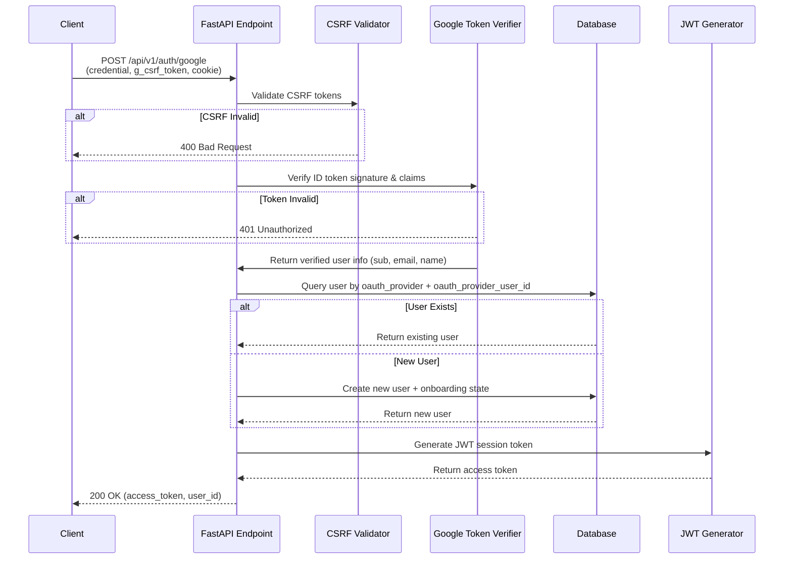

# Design Document: Google OAuth Authentication

## Overview

This design document specifies the implementation of secure Google OAuth 2.0 authentication for the Shuren backend application. The implementation follows the latest official Google Identity Services documentation (December 2024) and integrates seamlessly with the existing JWT-based authentication system.

The Google OAuth authentication flow enables users to authenticate using their Google accounts (both Gmail and Google Workspace) without creating a separate password. The implementation includes comprehensive security measures including CSRF protection via double-submit-cookie pattern, thorough ID token verification (signature, claims, email verification), and proper user identification using Google's immutable `sub` claim.

The design integrates with the existing authentication infrastructure:
- Reuses the existing `User` model with OAuth support fields
- Generates standard JWT tokens for session management
- Maintains consistency with email/password authentication flow
- Supports automatic user account creation for new OAuth users
- Creates onboarding state for new users to guide them through setup

## Architecture

### High-Level Flow



### Component Architecture

The implementation consists of four main layers:

1. **API Layer** (`app/api/v1/endpoints/auth.py`)
   - Handles HTTP request/response
   - Orchestrates authentication flow
   - Returns standardized responses

2. **Security Layer** (`app/core/security.py`)
   - CSRF token validation
   - Google ID token verification
   - JWT token generation

3. **Data Layer** (`app/models/user.py`, `app/schemas/auth.py`)
   - User model with OAuth support
   - Request/response schemas
   - Database operations

4. **Configuration Layer** (`app/core/config.py`)
   - Environment-based configuration
   - Google OAuth credentials management

## Components and Interfaces

### 1. API Endpoint

**Location**: `app/api/v1/endpoints/auth.py`

**Endpoint**: `POST /api/v1/auth/google`

**Request Schema** (`GoogleAuthRequest`):
```python
class GoogleAuthRequest(BaseModel):
    credential: str  # Google ID token (renamed from id_token)
    g_csrf_token: str  # CSRF token from request body
```

**Request Headers**:
- `Cookie: g_csrf_token=<token_value>` (required)

**Response Schema** (`TokenResponse`):
```python
class TokenResponse(BaseModel):
    access_token: str  # JWT token for session
    token_type: str = "bearer"
    user_id: str  # UUID of authenticated user
```

**Error Responses**:
- `400 Bad Request`: CSRF validation failed or missing required fields
- `401 Unauthorized`: Invalid Google token, verification failed, or email not verified
- `422 Unprocessable Entity`: Request validation failed

**Function Signature**:
```python
async def google_auth(
    auth_request: GoogleAuthRequest,
    request: Request,  # FastAPI Request for cookie access
    db: Annotated[AsyncSession, Depends(get_db)]
) -> TokenResponse
```

### 2. CSRF Validator

**Location**: `app/core/security.py`

**Function**: `validate_csrf_token`

```python
def validate_csrf_token(
    cookie_token: Optional[str],
    body_token: Optional[str]
) -> None:
    """
    Validate CSRF tokens using double-submit-cookie pattern.
    
    Args:
        cookie_token: g_csrf_token from cookie
        body_token: g_csrf_token from request body
        
    Raises:
        HTTPException(400): If tokens are missing or don't match
    """
```

**Validation Logic**:
1. Check both tokens are present (not None, not empty)
2. Compare tokens for exact match (constant-time comparison)
3. Raise HTTPException(400) if validation fails
4. Log security violations for monitoring

### 3. Google Token Verifier

**Location**: `app/core/security.py`

**Function**: `verify_google_token` (enhanced version)

```python
async def verify_google_token(token: str) -> Dict[str, Any]:
    """
    Verify Google ID token and extract user information.
    
    Performs comprehensive verification:
    - Signature verification using Google's public keys
    - Audience (aud) claim validation
    - Issuer (iss) claim validation
    - Expiration (exp) claim validation
    - Email verification status check
    - Hosted domain (hd) validation for Workspace accounts
    
    Args:
        token: Google ID token string
        
    Returns:
        Dictionary with verified user information:
        {
            'sub': str,  # Google user ID (unique, immutable)
            'email': str,
            'email_verified': bool,
            'name': str,
            'picture': str,  # Optional
            'hd': str  # Optional, for Workspace accounts
        }
        
    Raises:
        ValueError: If token verification fails
    """
```

**Verification Steps**:
1. Call `id_token.verify_oauth2_token(token, requests.Request(), GOOGLE_CLIENT_ID)`
2. Verify `iss` claim is "accounts.google.com" or "https://accounts.google.com"
3. Verify `aud` claim matches configured `GOOGLE_CLIENT_ID`
4. Verify `exp` claim (handled automatically by verify_oauth2_token)
5. Verify `email_verified` is `True`
6. If `hd` claim present, verify it matches email domain
7. Return sanitized user information dictionary

**Error Handling**:
- Catch `ValueError` from verify_oauth2_token
- Log verification failures with sanitized information (no token content)
- Re-raise with descriptive error message

### 4. User Account Manager

**Location**: `app/api/v1/endpoints/auth.py` (within google_auth function)

**Logic**: User lookup and creation

```python
# Query logic
stmt = select(User).where(
    (User.oauth_provider == 'google') &
    (User.oauth_provider_user_id == google_sub),
    User.deleted_at.is_(None)
)
```

**User Creation Logic**:
```python
new_user = User(
    email=email,
    hashed_password=None,  # OAuth users have no password
    full_name=name or email.split('@')[0],
    oauth_provider='google',
    oauth_provider_user_id=google_sub,  # Use 'sub' claim
    is_active=True
)

# Create associated onboarding state
onboarding_state = OnboardingState(
    user_id=new_user.id,
    current_step=1,
    is_complete=False,
    step_data={}
)
```

**Important Design Decisions**:
- Use `sub` claim (not email) as `oauth_provider_user_id` for immutability
- Query only by OAuth credentials (not email) to avoid conflicts
- Set `hashed_password` to `None` for OAuth users
- Always create onboarding state for new users
- Use email prefix as fallback if name not provided

### 5. JWT Session Generator

**Location**: `app/core/security.py`

**Function**: `create_access_token` (existing, no changes needed)

```python
def create_access_token(
    data: Dict[str, Any],
    expires_delta: Optional[timedelta] = None
) -> str:
    """
    Create JWT access token with HS256 algorithm.
    
    Configuration:
    - Algorithm: HS256
    - Expiration: 24 hours (configurable via JWT_ACCESS_TOKEN_EXPIRE_HOURS)
    - Secret: JWT_SECRET_KEY from environment
    """
```

## Data Models

### User Model

**Location**: `app/models/user.py`

**Existing Schema** (no changes required):
```python
class User(BaseModel):
    __tablename__ = "users"
    
    # Identity fields
    id: UUID (primary key)
    email: String(255) (unique, not null)
    hashed_password: String(255) (nullable)  # Null for OAuth users
    full_name: String(255) (not null)
    
    # OAuth fields
    oauth_provider: String(50) (nullable)  # 'google' or NULL
    oauth_provider_user_id: String(255) (nullable)  # Google 'sub' claim
    
    # Status
    is_active: Boolean (default True)
    
    # Timestamps (from BaseModel)
    created_at: DateTime
    updated_at: DateTime
    deleted_at: DateTime (nullable)
    
    # Constraints
    UniqueConstraint('oauth_provider', 'oauth_provider_user_id')
    Index('idx_users_oauth', ['oauth_provider', 'oauth_provider_user_id'])
```

**Key Design Points**:
- `oauth_provider_user_id` stores Google's `sub` claim (immutable identifier)
- `hashed_password` is nullable to support OAuth-only users
- Unique constraint prevents duplicate OAuth accounts
- Index on OAuth fields for efficient lookups
- Soft delete support via `deleted_at` timestamp

### Request/Response Schemas

**Location**: `app/schemas/auth.py`

**GoogleAuthRequest** (modified):
```python
class GoogleAuthRequest(BaseModel):
    """Schema for Google OAuth authentication request"""
    credential: str = Field(
        ...,
        description="Google ID token from OAuth flow",
        min_length=1
    )
    g_csrf_token: str = Field(
        ...,
        description="CSRF token for double-submit-cookie validation",
        min_length=1
    )
```

**TokenResponse** (existing, no changes):
```python
class TokenResponse(BaseModel):
    """Schema for authentication token response"""
    access_token: str
    token_type: str = "bearer"
    user_id: str
```

### Configuration Schema

**Location**: `app/core/config.py`

**Existing Configuration** (no changes required):
```python
class Settings(BaseSettings):
    # Google OAuth Configuration
    GOOGLE_CLIENT_ID: str  # Required
    GOOGLE_CLIENT_SECRET: str  # Required
    
    # JWT Configuration
    JWT_SECRET_KEY: str
    JWT_ALGORITHM: str = "HS256"
    JWT_ACCESS_TOKEN_EXPIRE_HOURS: int = 24
```

**Validation**:
- Pydantic validates all required fields are present on startup
- Empty strings are rejected by Pydantic's validation
- Configuration errors raise clear exceptions before server starts

## Correctness Properties

