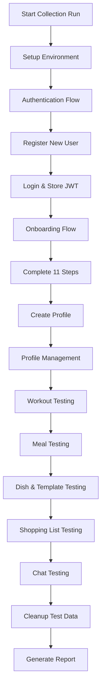

# Design Document: Postman API Testing Framework

## Overview

This design specifies a comprehensive end-to-end API testing framework for the Shuren fitness application backend using Postman. The framework provides automated validation of all API endpoints, authentication flows, data integrity, and business logic through organized collections, reusable scripts, and property-based testing patterns.

The testing framework is structured around Postman's core capabilities:
- **Collections**: Organized groups of API requests with folder hierarchy
- **Environments**: Variable sets for different deployment stages (dev, staging, prod)
- **Pre-request Scripts**: JavaScript executed before requests for setup and data generation
- **Test Scripts**: JavaScript executed after responses for validation and assertions
- **Collection Runner**: Sequential execution engine for automated test suites
- **Postman Power Integration**: Programmatic execution via Kiro's Postman MCP server

The framework validates 8 major API endpoint groups across 50+ endpoints, covering authentication, onboarding, profiles, workouts, meals, dishes, meal templates, shopping lists, and chat interactions.

## Architecture

### High-Level Structure

```
Shuren API Testing Workspace
├── Collection: Shuren Backend API - E2E Tests
│   ├── Folder: 01 - Authentication
│   ├── Folder: 02 - Onboarding
│   ├── Folder: 03 - Profiles
│   ├── Folder: 04 - Workouts
│   ├── Folder: 05 - Meals
│   ├── Folder: 06 - Dishes
│   ├── Folder: 07 - Meal Templates
│   ├── Folder: 08 - Shopping List
│   └── Folder: 09 - Chat
├── Environment: Development
├── Environment: Staging
└── Environment: Production
```

### Request Organization Pattern

Each folder follows a consistent structure:
1. **Happy Path Requests**: Successful scenarios with valid data
2. **Validation Error Requests**: Invalid data to test error handling
3. **Edge Case Requests**: Boundary conditions and unusual inputs
4. **Authentication Error Requests**: Missing or invalid tokens

### Execution Flow




## Components and Interfaces

### 1. Postman Workspace Component

**Purpose**: Container for all testing artifacts and configurations

**Structure**:
- Workspace Name: "Shuren API Testing"
- Visibility: Team (shared across development team)
- Collections: 1 main collection with 9 folders
- Environments: 3 (Development, Staging, Production)

**Interface**:
```javascript
// Workspace configuration (conceptual)
{
  "name": "Shuren API Testing",
  "type": "team",
  "collections": ["shuren-backend-e2e"],
  "environments": ["dev", "staging", "prod"]
}
```

### 2. Collection Component

**Purpose**: Organized container for all API requests with shared configuration

**Structure**:
- Collection-level variables (shared across all requests)
- Collection-level pre-request scripts (authentication setup)
- Collection-level test scripts (common validations)
- Folder hierarchy (9 folders by API domain)

**Collection Variables**:
```javascript
{
  "api_version": "v1",
  "timeout_ms": 5000,
  "test_user_prefix": "test_",
  "timestamp": "{{$timestamp}}"
}
```

**Collection Pre-request Script**:
```javascript
// Set authentication header if JWT token exists
if (pm.environment.get("jwt_token")) {
    pm.request.headers.add({
        key: "Authorization",
        value: "Bearer " + pm.environment.get("jwt_token")
    });
}

// Set content type for JSON requests
pm.request.headers.add({
    key: "Content-Type",
    value: "application/json"
});
```

**Collection Test Script**:
```javascript
// Common validation for all requests
pm.test("Response time is acceptable", function() {
    pm.expect(pm.response.responseTime).to.be.below(5000);
});

pm.test("Response has valid JSON", function() {
    pm.response.to.be.json;
});
```

### 3. Environment Component

**Purpose**: Store environment-specific variables (URLs, credentials, test data)

**Development Environment Variables**:
```javascript
{
  "base_url": "http://localhost:8000",
  "api_base": "{{base_url}}/api/v1",
  "jwt_token": "",
  "user_id": "",
  "test_email": "",
  "test_password": "",
  "profile_id": "",
  "onboarding_step": 0,
  "workout_plan_id": "",
  "meal_plan_id": "",
  "meal_template_id": "",
  "chat_session_id": "",
  "dish_id": ""
}
```

**Staging Environment Variables**:
```javascript
{
  "base_url": "https://staging-api.shuren.app",
  "api_base": "{{base_url}}/api/v1",
  // ... same structure as dev
}
```

**Production Environment Variables**:
```javascript
{
  "base_url": "https://api.shuren.app",
  "api_base": "{{base_url}}/api/v1",
  // ... same structure as dev
}
```

### 4. Request Component

**Purpose**: Individual API call with method, URL, headers, body, and tests

**Request Structure**:
```javascript
{
  "name": "Register New User",
  "request": {
    "method": "POST",
    "url": "{{api_base}}/auth/register",
    "header": [],
    "body": {
      "mode": "raw",
      "raw": "{\n  \"email\": \"{{test_email}}\",\n  \"password\": \"{{test_password}}\"\n}"
    }
  },
  "event": [
    {
      "listen": "prerequest",
      "script": {
        "exec": ["// Pre-request script"]
      }
    },
    {
      "listen": "test",
      "script": {
        "exec": ["// Test script"]
      }
    }
  ]
}
```

### 5. Pre-request Script Component

**Purpose**: Execute JavaScript before sending request for data generation and setup

**Common Patterns**:

**Generate Random Test Data**:
```javascript
// Generate unique email for registration
const timestamp = Date.now();
const randomNum = Math.floor(Math.random() * 10000);
const testEmail = `test_${timestamp}_${randomNum}@example.com`;
pm.environment.set("test_email", testEmail);

// Generate secure password
const password = `Test${randomNum}!Pass`;
pm.environment.set("test_password", password);
```

**Set Dynamic Headers**:
```javascript
// Add request ID for tracing
pm.request.headers.add({
    key: "X-Request-ID",
    value: pm.variables.replaceIn("{{$guid}}")
});
```

**Prepare Request Body**:
```javascript
// Build onboarding step payload
const stepData = {
    step: pm.environment.get("onboarding_step"),
    data: {
        age: 25,
        weight: 70,
        height: 175
    }
};
pm.environment.set("step_payload", JSON.stringify(stepData));
```

### 6. Test Script Component

**Purpose**: Execute JavaScript after receiving response for validation and data extraction

**Common Patterns**:

**Status Code Validation**:
```javascript
pm.test("Status code is 200", function() {
    pm.response.to.have.status(200);
});

pm.test("Status code is 201 Created", function() {
    pm.response.to.have.status(201);
});

pm.test("Status code is 422 Validation Error", function() {
    pm.response.to.have.status(422);
});
```

**Response Schema Validation**:
```javascript
pm.test("Response has required fields", function() {
    const jsonData = pm.response.json();
    pm.expect(jsonData).to.have.property("id");
    pm.expect(jsonData).to.have.property("email");
    pm.expect(jsonData).to.have.property("created_at");
});

pm.test("Response matches schema", function() {
    const schema = {
        type: "object",
        required: ["id", "email", "created_at"],
        properties: {
            id: { type: "string", format: "uuid" },
            email: { type: "string", format: "email" },
            created_at: { type: "string", format: "date-time" }
        }
    };
    pm.response.to.have.jsonSchema(schema);
});
```

**Data Extraction and Storage**:
```javascript
pm.test("Extract JWT token", function() {
    const jsonData = pm.response.json();
    pm.expect(jsonData).to.have.property("access_token");
    pm.environment.set("jwt_token", jsonData.access_token);
    pm.environment.set("user_id", jsonData.user.id);
});
```

**Business Logic Validation**:
```javascript
pm.test("Meal plan matches dietary preferences", function() {
    const jsonData = pm.response.json();
    const dietType = pm.environment.get("diet_type");
    pm.expect(jsonData.diet_type).to.equal(dietType);
});

pm.test("Workout schedule has correct days", function() {
    const jsonData = pm.response.json();
    pm.expect(jsonData.workout_days).to.be.an("array");
    pm.expect(jsonData.workout_days.length).to.be.at.least(3);
});
```

### 7. Folder Component

**Purpose**: Group related requests with shared configuration

**Folder Structure**:
```javascript
{
  "name": "01 - Authentication",
  "item": [
    // Array of requests
  ],
  "event": [
    {
      "listen": "prerequest",
      "script": {
        "exec": ["// Folder-level pre-request script"]
      }
    },
    {
      "listen": "test",
      "script": {
        "exec": ["// Folder-level test script"]
      }
    }
  ]
}
```

**Folder-level Scripts**: Execute for all requests in folder, useful for:
- Setting up authentication for protected endpoints
- Common validation logic for related endpoints
- Cleanup after folder execution

### 8. Collection Runner Component

**Purpose**: Execute collection requests in sequence with reporting

**Configuration**:
```javascript
{
  "collection": "shuren-backend-e2e",
  "environment": "development",
  "iterations": 1,
  "delay": 100, // ms between requests
  "bail": false, // continue on failure
  "reporters": ["cli", "json", "html"],
  "reporter": {
    "html": {
      "export": "./test-results/report.html"
    }
  }
}
```

**Execution Order**:
1. Collection pre-request script
2. Folder pre-request script
3. Request pre-request script
4. Send HTTP request
5. Request test script
6. Folder test script
7. Collection test script

### 9. Postman Power Integration Component

**Purpose**: Programmatic execution via Kiro's Postman MCP server

**Interface** (via Kiro Powers):
```javascript
// Activate Postman Power
kiroPowers.activate("postman")

// Create workspace
kiroPowers.use({
  powerName: "postman",
  serverName: "postman",
  toolName: "create_workspace",
  arguments: {
    name: "Shuren API Testing",
    type: "team"
  }
})

// Import collection
kiroPowers.use({
  powerName: "postman",
  serverName: "postman",
  toolName: "import_collection",
  arguments: {
    collection: collectionJson,
    workspace_id: workspaceId
  }
})

// Run collection
kiroPowers.use({
  powerName: "postman",
  serverName: "postman",
  toolName: "run_collection",
  arguments: {
    collection_id: collectionId,
    environment_id: environmentId
  }
})
```


## Data Models

### Test User Model

Represents a test user created during test execution:

```javascript
{
  "email": "test_1234567890_5678@example.com",
  "password": "Test5678!Pass",
  "id": "uuid-string",
  "jwt_token": "eyJhbGciOiJIUzI1NiIsInR5cCI6IkpXVCJ9...",
  "created_at": "2024-01-15T10:30:00Z"
}
```

### Onboarding State Model

Tracks progress through 11 onboarding steps:

```javascript
{
  "user_id": "uuid-string",
  "current_step": 5,
  "completed_steps": [1, 2, 3, 4, 5],
  "step_data": {
    "1": { "age": 25, "gender": "male" },
    "2": { "weight": 70, "height": 175 },
    "3": { "fitness_level": "intermediate" },
    "4": { "goal": "muscle_gain" },
    "5": { "workout_days": ["monday", "wednesday", "friday"] }
  },
  "is_complete": false
}
```

### Profile Model

Complete user profile after onboarding:

```javascript
{
  "id": "uuid-string",
  "user_id": "uuid-string",
  "version": 1,
  "is_locked": false,
  "fitness_goals": [
    {
      "goal_type": "muscle_gain",
      "target_value": 75,
      "target_date": "2024-06-01"
    }
  ],
  "physical_constraints": {
    "equipment": ["dumbbells", "resistance_bands"],
    "injuries": [],
    "limitations": []
  },
  "dietary_preferences": {
    "diet_type": "balanced",
    "restrictions": ["lactose"],
    "allergies": [],
    "excluded_ingredients": []
  },
  "workout_schedule": {
    "days": ["monday", "wednesday", "friday"],
    "preferred_time": "18:00"
  },
  "meal_schedule": {
    "breakfast_time": "08:00",
    "lunch_time": "13:00",
    "dinner_time": "19:00",
    "snack_times": ["10:00", "16:00"]
  }
}
```

### Workout Plan Model

Generated workout plan based on profile:

```javascript
{
  "id": "uuid-string",
  "user_id": "uuid-string",
  "plan_type": "muscle_gain",
  "duration_weeks": 12,
  "workout_days": [
    {
      "day_number": 1,
      "day_name": "monday",
      "focus": "upper_body",
      "exercises": [
        {
          "name": "Bench Press",
          "sets": 4,
          "reps": 8,
          "rest_seconds": 90,
          "gif_url": "https://..."
        }
      ]
    }
  ]
}
```

### Meal Plan Model

Nutritional structure for user:

```javascript
{
  "id": "uuid-string",
  "user_id": "uuid-string",
  "daily_calories": 2500,
  "protein_grams": 150,
  "carbs_grams": 300,
  "fats_grams": 70,
  "meals_per_day": 4,
  "diet_type": "balanced"
}
```

### Meal Template Model

Weekly meal recommendations:

```javascript
{
  "id": "uuid-string",
  "user_id": "uuid-string",
  "week_start_date": "2024-01-15",
  "days": [
    {
      "date": "2024-01-15",
      "meals": [
        {
          "meal_type": "breakfast",
          "time": "08:00",
          "target_calories": 600,
          "recommended_dishes": [
            {
              "dish_id": "uuid-string",
              "dish_name": "Oatmeal with Berries",
              "calories": 580,
              "protein": 20,
              "carbs": 90,
              "fats": 15
            }
          ]
        }
      ]
    }
  ]
}
```

### Dish Model

Individual dish with ingredients:

```javascript
{
  "id": "uuid-string",
  "name": "Grilled Chicken Salad",
  "meal_type": "lunch",
  "diet_types": ["balanced", "low_carb"],
  "calories": 450,
  "protein": 40,
  "carbs": 30,
  "fats": 20,
  "prep_time_minutes": 15,
  "ingredients": [
    {
      "ingredient_id": "uuid-string",
      "name": "Chicken Breast",
      "quantity": 200,
      "unit": "grams",
      "category": "protein"
    }
  ]
}
```

### Shopping List Model

Aggregated ingredients from meal template:

```javascript
{
  "user_id": "uuid-string",
  "week_start_date": "2024-01-15",
  "categories": [
    {
      "category": "protein",
      "ingredients": [
        {
          "name": "Chicken Breast",
          "total_quantity": 1400,
          "unit": "grams"
        }
      ]
    }
  ],
  "total_items": 25
}
```

### Chat Session Model

Conversation with AI agents:

```javascript
{
  "session_id": "uuid-string",
  "user_id": "uuid-string",
  "started_at": "2024-01-15T10:00:00Z",
  "ended_at": null,
  "is_active": true,
  "messages": [
    {
      "message_id": "uuid-string",
      "role": "user",
      "content": "What should I eat for lunch?",
      "timestamp": "2024-01-15T10:00:00Z"
    },
    {
      "message_id": "uuid-string",
      "role": "assistant",
      "content": "Based on your meal plan...",
      "timestamp": "2024-01-15T10:00:05Z",
      "agent": "diet_planning"
    }
  ]
}
```

### Error Response Model

Standard error format:

```javascript
{
  "detail": "Validation error",
  "status_code": 422,
  "errors": [
    {
      "field": "email",
      "message": "Invalid email format",
      "type": "value_error"
    }
  ]
}
```

### Test Execution Report Model

Results from Collection Runner:

```javascript
{
  "collection": "Shuren Backend API - E2E Tests",
  "environment": "Development",
  "timestamp": "2024-01-15T10:00:00Z",
  "duration_ms": 45000,
  "total_requests": 52,
  "passed_tests": 180,
  "failed_tests": 2,
  "skipped_tests": 0,
  "folders": [
    {
      "name": "01 - Authentication",
      "requests": 8,
      "passed": 24,
      "failed": 0
    }
  ],
  "failures": [
    {
      "request": "Update Profile",
      "test": "Response time is acceptable",
      "error": "Expected response time to be below 5000ms but got 5200ms"
    }
  ]
}
```


## Correctness Properties

*A property is a characteristic or behavior that should hold true across all valid executions of a system—essentially, a formal statement about what the system should do. Properties serve as the bridge between human-readable specifications and machine-verifiable correctness guarantees.*

### Authentication and Authorization Properties

**Property 1: Valid registration creates user**
*For any* valid registration payload (unique email, valid password), the API should return 201 status with user details including id, email, and created_at timestamp.
**Validates: Requirements 2.1**

**Property 2: Duplicate email registration fails**
*For any* email address that already exists in the system, registration attempts should return 400 status with an error message indicating the email is already registered.
**Validates: Requirements 2.2**

**Property 3: Valid credentials authenticate successfully**
*For any* valid email and password combination, login should return 200 status with a JWT access token and user details.
**Validates: Requirements 2.3**

**Property 4: Invalid credentials are rejected**
*For any* invalid credentials (wrong password, non-existent email, or malformed input), login should return 401 status with an authentication error message.
**Validates: Requirements 2.4**

**Property 5: OAuth authentication succeeds**
*For any* valid Google OAuth token, authentication should return 200 status with a JWT access token and user details.
**Validates: Requirements 2.5**

**Property 6: JWT token validation across endpoints**
*For any* protected endpoint, requests with valid JWT tokens should return successful responses (200/201), requests without tokens should return 401, and requests with expired tokens should return 401.
**Validates: Requirements 2.6, 2.7, 2.8**


### Onboarding Flow Properties

**Property 7: Onboarding state reflects progress**
*For any* user in the onboarding process, requesting onboarding state should return their current step number and all previously saved step data.
**Validates: Requirements 3.1**

**Property 8: Valid step data is saved**
*For any* valid step payload (steps 1-11 with correct data structure), submission should return 200 status with updated onboarding state showing the saved data.
**Validates: Requirements 3.2**

**Property 9: Invalid step data is rejected**
*For any* invalid step payload (missing required fields, wrong data types, or out-of-range values), submission should return 422 status with detailed validation errors.
**Validates: Requirements 3.3**

**Property 10: Steps can be submitted in any order**
*For any* step number (1-11), submission should succeed regardless of the current step, allowing users to update previously completed steps or skip ahead.
**Validates: Requirements 3.4**

**Property 11: Complete onboarding creates profile**
*For any* user with all 11 steps completed, calling the complete endpoint should return 200 status and create a user profile with all onboarding data.
**Validates: Requirements 3.5**

**Property 12: Incomplete onboarding prevents completion**
*For any* user missing required data from any of the 11 steps, calling the complete endpoint should return 400 status with a list of missing fields.
**Validates: Requirements 3.6**

**Property 13: Completed onboarding is immutable**
*For any* user who has completed onboarding, attempts to submit additional step data should be rejected with an appropriate error.
**Validates: Requirements 3.7**


### Profile Management Properties

**Property 14: Profile returns complete data**
*For any* user with a profile, requesting the profile should return 200 status with complete data including fitness goals, physical constraints, dietary preferences, workout schedule, and meal schedule.
**Validates: Requirements 4.1**

**Property 15: Profile updates create versions**
*For any* valid profile update, the API should return 200 status with the updated profile, and the version number should increment by 1.
**Validates: Requirements 4.2**

**Property 16: Invalid profile updates are rejected**
*For any* invalid profile update (wrong data types, missing required fields, or constraint violations), the API should return 422 status with detailed validation errors.
**Validates: Requirements 4.3**

**Property 17: Locked profiles prevent updates**
*For any* locked profile, update attempts should return 403 status with a message indicating the profile is locked.
**Validates: Requirements 4.4**

**Property 18: Profile locking succeeds**
*For any* unlocked profile, requesting a lock should return 200 status and set the is_locked flag to true.
**Validates: Requirements 4.5**

### Workout and Meal Plan Properties

**Property 19: Plans return complete data**
*For any* user with workout or meal plans, requesting the plan should return complete data (workout days with exercises, or nutritional structure with calories/macros).
**Validates: Requirements 5.1, 6.1**

**Property 20: Specific day/meal returns filtered data**
*For any* valid day number or meal type, requesting specific data should return only that subset, not all data.
**Validates: Requirements 5.2**

**Property 21: Today's data matches current date**
*For any* user with plans, requesting today's workout or meals should return data matching the current day of the week or current date.
**Validates: Requirements 5.3, 6.5, 8.1**

**Property 22: Week data returns seven days**
*For any* user with plans, requesting a week's data should return exactly 7 days of workouts or meals.
**Validates: Requirements 5.4, 8.3**

**Property 23: Plan updates succeed**
*For any* valid plan or schedule update, the API should return 200 status with the updated data.
**Validates: Requirements 5.5, 5.7, 6.2, 6.4**

**Property 24: Next item is upcoming**
*For any* user with schedules and current time, requesting the next workout or meal should return the upcoming item based on the schedule.
**Validates: Requirements 6.6, 8.2**


### Dish Search and Filtering Properties

**Property 25: Unfiltered search returns all dishes**
*For any* search request without filters, the API should return a paginated list of all available dishes.
**Validates: Requirements 7.1**

**Property 26: Filters return matching dishes only**
*For any* filter (meal_type, diet_type, or excluded ingredients), search results should only contain dishes that match the filter criteria.
**Validates: Requirements 7.2, 7.3, 7.4**

**Property 27: Dish details return complete information**
*For any* valid dish ID, requesting dish details should return 200 status with complete information including name, nutritional data, and all ingredients with quantities.
**Validates: Requirements 7.5**

**Property 28: Pagination works correctly**
*For any* search with results exceeding page size, the API should return pagination metadata (total, page, page_size), and requesting specific pages should return the correct subset of results.
**Validates: Requirements 7.7, 10.3, 10.6**

### Meal Template and Shopping List Properties

**Property 29: Meal template regeneration succeeds**
*For any* user with a meal plan, requesting template regeneration should return 200 status and create a new weekly template.
**Validates: Requirements 8.4**

**Property 30: Recommended dishes respect preferences**
*For any* user with dietary preferences (diet type, restrictions, allergies, excluded ingredients), all recommended dishes should be compatible with those preferences and match the meal type.
**Validates: Requirements 8.6, 8.7**

**Property 31: Shopping list aggregates correctly**
*For any* user with a meal template, the shopping list should contain all ingredients from the template, grouped by category, with quantities summed for duplicate ingredients, and each ingredient should include name, total quantity, and unit.
**Validates: Requirements 9.1, 9.2, 9.3, 9.5**

### Chat Interaction Properties

**Property 32: Chat messages route to agents**
*For any* valid chat message, the API should return 200 status with a response from the appropriate AI agent.
**Validates: Requirements 10.1**

**Property 33: Chat session lifecycle works**
*For any* user, starting a session should return a session_id, ending an active session should return 200 and mark it inactive, and unauthenticated chat requests should return 401.
**Validates: Requirements 10.2, 10.4, 10.5**


### Data Validation Properties

**Property 34: Request validation enforces constraints**
*For any* request with missing required fields, invalid data types, out-of-range numeric values, invalid string patterns, or invalid enum values, the API should return 422 status with detailed field-level validation errors.
**Validates: Requirements 11.1, 11.2, 11.4, 11.5, 11.6**

**Property 35: Response schemas are consistent**
*For any* successful API response, the JSON structure should match the expected Pydantic schema for that endpoint.
**Validates: Requirements 11.3**

**Property 36: Date/time format is standardized**
*For any* date/time field in requests or responses, the API should accept and return ISO 8601 format.
**Validates: Requirements 11.7**

### Error Handling Properties

**Property 37: Resource not found returns 404**
*For any* request for a non-existent resource (user, profile, dish, workout, meal, etc.), the API should return 404 status with a descriptive message.
**Validates: Requirements 4.6, 5.8, 6.7, 7.6, 8.5, 9.4, 13.2**

**Property 38: HTTP error codes are correct**
*For any* error condition, the API should return the appropriate HTTP status code: 401 for authentication failures, 403 for authorization failures, 422 for validation errors, 429 for rate limiting, 500 for server errors, and 503 for service unavailability.
**Validates: Requirements 13.1, 13.3, 13.4, 13.5, 13.6, 13.7**

### End-to-End Journey Properties

**Property 39: Complete user journeys succeed**
*For any* new user, the complete journey (register → login → onboarding → profile creation) should succeed, and for any user with a profile, domain-specific journeys (workout management, meal management, chat interaction, profile updates) should succeed with data consistency maintained across all related endpoints.
**Validates: Requirements 14.1, 14.2, 14.3, 14.4, 14.5, 14.6**

### Performance Properties

**Property 40: Response times meet targets**
*For any* API request, response times should meet the specified targets: profile requests < 100ms, onboarding saves < 200ms, workout plans < 150ms, meal templates < 300ms, shopping lists < 200ms, and full collection runs < 5 minutes.
**Validates: Requirements 15.1, 15.2, 15.3, 15.4, 15.5, 15.6**

**Property 41: Concurrent requests succeed**
*For any* set of concurrent requests to the API, all requests should complete successfully without errors or data corruption.
**Validates: Requirements 15.7**

### Test Automation Properties

**Property 42: Test execution generates reports**
*For any* collection run, the system should generate a test report with pass/fail status for each request and overall statistics.
**Validates: Requirements 12.7**

**Property 43: Test cleanup succeeds**
*For any* test execution, cleanup scripts should successfully remove test data after completion.
**Validates: Requirements 12.8**


## Error Handling

### Error Response Structure

All API errors follow a consistent Pydantic schema:

```javascript
{
  "detail": "Human-readable error message",
  "status_code": 422,
  "errors": [
    {
      "field": "email",
      "message": "Invalid email format",
      "type": "value_error"
    }
  ]
}
```

### Error Categories and Test Coverage

**Authentication Errors (401)**:
- Missing JWT token
- Expired JWT token
- Invalid JWT token format
- Malformed Authorization header

**Authorization Errors (403)**:
- Locked profile update attempts
- Accessing other users' resources
- Insufficient permissions

**Validation Errors (422)**:
- Missing required fields
- Invalid data types
- Out-of-range numeric values
- Invalid string patterns (email, UUID)
- Invalid enum values
- Constraint violations

**Not Found Errors (404)**:
- Non-existent user ID
- Non-existent profile
- Non-existent dish ID
- Non-existent workout/meal plan
- Non-existent chat session

**Server Errors (500)**:
- Unhandled exceptions
- Database query failures
- External service failures

**Service Unavailable (503)**:
- Database connection failures
- Redis connection failures
- External API timeouts

### Test Script Error Validation Pattern

```javascript
pm.test("Error response has correct structure", function() {
    const jsonData = pm.response.json();
    pm.expect(jsonData).to.have.property("detail");
    pm.expect(jsonData).to.have.property("status_code");
    pm.expect(jsonData.status_code).to.equal(pm.response.code);
});

pm.test("Validation errors include field details", function() {
    const jsonData = pm.response.json();
    if (pm.response.code === 422) {
        pm.expect(jsonData).to.have.property("errors");
        pm.expect(jsonData.errors).to.be.an("array");
        jsonData.errors.forEach(error => {
            pm.expect(error).to.have.property("field");
            pm.expect(error).to.have.property("message");
        });
    }
});
```

